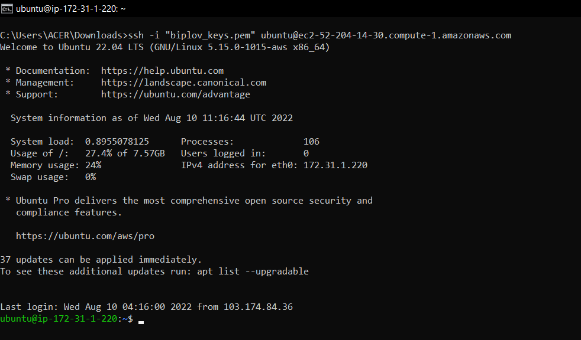
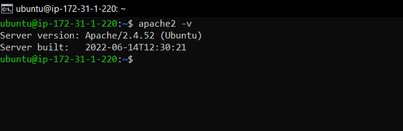
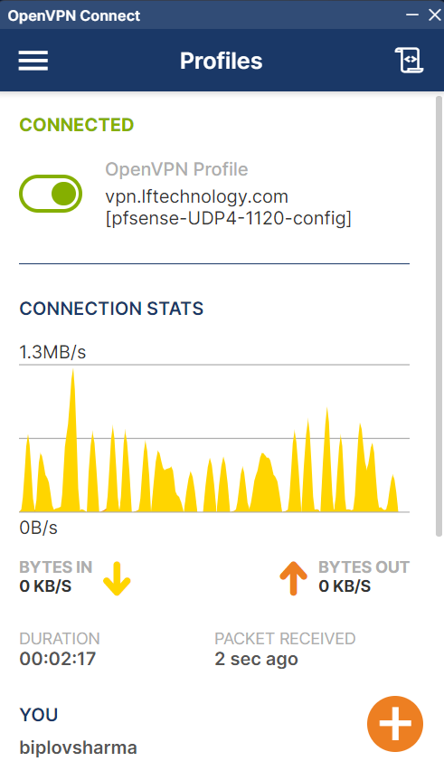

# DevOps Assignment

## 1. EC2 Instance

- EC2 Instance name: `biplov_devops_ec2`
- Public IP: `ec2-52-204-14-30.compute-1.amazonaws.com`

### Commands to login via ssh

- `chmod 400 biplov_keys.pem`
- `ssh -i "biplov_keys.pem" ubuntu@ec2-52-204-14-30.compute-1.amazonaws.com`
 <div align="center">
  <br>
  <br>
    
  <br>
  <br>
</div>

### Commands to install httpd(apache)

- `sudo apt-get update`
- `sudo apt install apache2`
<div align="center">
  <br>
  <br>
    
  <br>
  <br>
</div>

## 2. Docker Images (React, Node)

- [React Image Dockerhub link](https://hub.docker.com/r/beingbiplov/node-client)
- [Node Image Dockerhub link](https://hub.docker.com/r/beingbiplov/node-server)

### Docker files

- [React Dockerfile](node_react_docker/client/Dockerfile)
- [Node Dockerfile](node_react_docker/server/Dockerfile)
- [Docker-compose file](node_react_docker/docker-compose.yml)

## 3. VPN setup

  <div align="center">
    <br>
    <br>
      
    <br>
    <br>
  </div>
 
 
 ## 4. Common HTTP status codes
 
 | HTTP Status Codes |
| ----------------- |
| `200 OK`
&nbsp;&nbsp; The request has succeeded. |
| `201 Created`
&nbsp;&nbsp; The request was successful, and as a result a new resource was created. |
| `301 Moved Permanently`
&nbsp;&nbsp; The requested resource has been permanently moved to a new URL |
| `400 Bad Request`
&nbsp;&nbsp; The server was unable to process the request sent by the client dur to client error. |
| `401 Unauthorized`
&nbsp;&nbsp; The request has failed because it lacks valid authentication credentials |
| `403 Forbidden`
&nbsp;&nbsp; The client does not have access rights to the content |
| `404 Not Found`
&nbsp;&nbsp; The server can not find the requested resource. |
| `410 Gone`
&nbsp;&nbsp; The requested content has been permanently deleted from server, with no forwarding address. |
| `500 Internal Server Error`
&nbsp;&nbsp; The server encountered an unexpected condition that prevented it from fulfilling the request. |
| `503 Service Unavailable`
&nbsp;&nbsp; The server is not ready to handle the request. |

## 5. Network Id and Broadcast Id

```
  IP: 150.10.20.30
  Class: Class B
  Subnet mask = 255.255.0.0

  Network Id = 150.10.0.0/16

  Broadcast Id = 150.10.255.255
```
